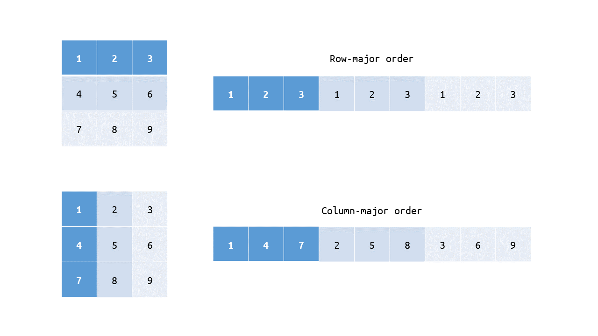

# MIPS Assembly Language Examples

Files:

- `macros.asm`: Common macros (MARS macros)
- `sle.asm`: Solve systems of linear equations (Ax = b)
- `mult-table.asm`: Print out multiplication tables from 2 to 9
- `ary-stack.asm`: Implement a stack using an array
- `qsort.asm` Implement quick sort algorithm

Use MARS MIPS simulator to run the codes.

## `sle.asm`

> Solve systems of linear equations (Ax = b) (A: 5x5, x: 5x1)

Each matrix is assumed to be supplied in column-major order.



Matrix:

```
| 7 1 7 9 3 |   | 4 |   | ? |
| 8 8 6 5 6 |   | 2 |   | ? |
| 4 1 3 7 8 | x | 6 | = | ? |
| 8 8 0 4 5 |   | 6 |   | ? |
| 4 4 2 1 7 |   | 5 |   | ? |
```

In memory:

```asm
# Matrix A
mat_A: .word 7 8 4 8 4
             1 8 1 8 4
             7 6 3 0 2
             9 5 7 4 1
             3 6 8 5 7

# Matrix x
mat_x: .word 4 2 6 6 5

# Result matrix
mat_b: .word 0 0 0 0 0
```

Result:

```
Result:
  | 141 |
  | 144 |
  | 118 |
  | 97 |
  | 77 |
```

## `mult-table.asm`

> Print out multiplication tables from 2 to 9

Result:

```
2 times table:
 - 2x1 = 2
 - 2x2 = 4
 - 2x3 = 6
 - 2x4 = 8
 - 2x5 = 10
 - 2x6 = 12
 - 2x7 = 14
 - 2x8 = 16
 - 2x9 = 18
3 times table:
 - 3x1 = 3
 - 3x2 = 6
 - 3x3 = 9
 - 3x4 = 12
 - 3x5 = 15
 - 3x6 = 18
 - 3x7 = 21
 - 3x8 = 24
 - 3x9 = 27
...
```

## `ary-stack.asm`

> Implement Stack using an array (stack capacity: 10)

Push/pop:

```
:: Usage:
::  - Input a zero or positive number => push
::  - Input a negative number => pop
> Input: 1
:: Stack: (size: 1) [ 1 ]
> Input: 2
:: Stack: (size: 2) [ 1 2 ]
> Input: 99
:: Stack: (size: 3) [ 1 2 99 ]
> Input: -1
:: Popped item: 99
:: Stack: (size: 2) [ 1 2 ]
> Input: -1
:: Popped item: 2
:: Stack: (size: 1) [ 1 ]
> Input: 77
:: Stack: (size: 2) [ 1 77 ]
> Input:
```

Stack capacity exceeded:

```
:: Usage:
::  - Input a zero or positive number => push
::  - Input a negative number => pop
> Input: 1
:: Stack: (size: 1) [ 1 ]
> Input: 2
:: Stack: (size: 2) [ 1 2 ]
> Input: 3
:: Stack: (size: 3) [ 1 2 3 ]
  ...
> Input: 9
:: Stack: (size: 9) [ 1 2 3 4 5 6 7 8 9 ]
> Input: 10
:: Stack: (size: 10) [ 1 2 3 4 5 6 7 8 9 10 ]
> Input: 11
:: WARN: Stack capacity exceeded! Your input has been discarded
:: Stack: (size: 10) [ 1 2 3 4 5 6 7 8 9 10 ]
> Input:
```

Stack is empty:

```
:: Usage:
::  - Input a zero or positive number => push
::  - Input a negative number => pop
> Input: -1
:: WARN: Stack is empty!
:: Stack: (size: 0) [ ]
> Input:
```

## `qsort.asm`

> Implement quick sort algorithm

The array is stored in the stack and its capacity is increased if needed. Check `resize_array()` macro.

C language version of the `sort` function:

```c
void sort (int *arr, int low, int high) {
    if (low >= high) return;
    int pivot = partition(arr, low, high);
    sort(arr, low, pivot - 1);
    sort(arr, pivot + 1, high);
}
```

Result:

```
> Input: 1
:: Array: (size: 1) [ 1 ]
> Input: 2
:: Array: (size: 2) [ 2 1 ]
> Input: 3
:: Array: (size: 3) [ 3 2 1 ]
> Input: 4
:: Array: (size: 4) [ 4 3 2 1 ]
> Input: 99
:: Array: (size: 5) [ 99 4 3 2 1 ]
> Input: 0
:: Array: (size: 6) [ 99 4 3 2 1 0 ]
> Input: -1
:: Array: (size: 7) [ 99 4 3 2 1 0 -1 ]
> Input: 124
:: Array: (size: 8) [ 124 99 4 3 2 1 0 -1 ]
> Input: 5
:: Array: (size: 9) [ 124 99 5 4 3 2 1 0 -1 ]
> Input: -5
:: Array: (size: 10) [ 124 99 5 4 3 2 1 0 -1 -5 ]
> Input: -3
:: Array: (size: 11) [ 124 99 5 4 3 2 1 0 -1 -3 -5 ]
> Input:
```
